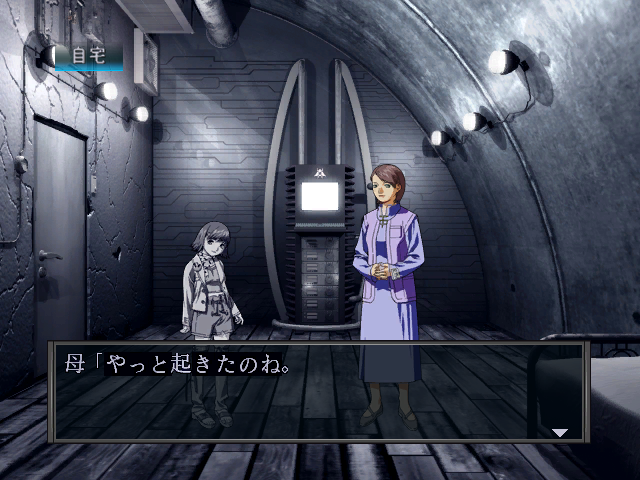
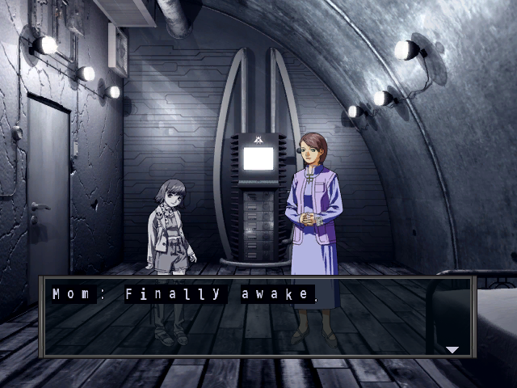

# SMT Nine English Translation Tools

Tools and technical documentation for translating **Shin Megami Tensei: Nine** (Xbox, 2002) into English.

The centrepiece is a discovery that the game engine already has a complete **halfwidth Latin rendering system** built in — it was just gated behind a single flag. A 2-byte patch enables halfwidth text globally, which means English characters render at half the width of kanji in dialogue boxes. This solves the text overflow problem that has stalled translation efforts since 2019.

## The Halfwidth Discovery

SMT Nine's rendering engine has a three-layer system for halfwidth text that was built during development but only activated for battle UI in the shipping game:

1. **sysfont.tbl** — The font table already classifies Latin characters (A-Z, a-z, 0-9) with halfwidth flags in its 18pt font section.
2. **XBE halfwidth character table** — A 259-entry lookup table at VA `0x3384A8` lists every character eligible for halfwidth rendering: Latin letters, digits, katakana, and symbols.
3. **Rendering flag gate** — At VA `0x151533`, a `test byte ptr [ebp+0x74], 0x10` instruction checks whether the current context should use halfwidth rendering. Battle UI sets this flag; the dialogue system does not.

**The fix:** NOP the conditional jump at XBE file offset `0x141537` (`74 47` → `90 90`). This bypasses the flag check and enables halfwidth table lookups for all text contexts. Combined with replacement halfwidth Latin font glyphs, English text renders correctly in dialogue boxes at half-width.

| Original (Japanese fullwidth) | Patched (English halfwidth) |
|:---:|:---:|
|  |  |

See [docs/HALFWIDTH_SYSTEM.md](docs/HALFWIDTH_SYSTEM.md) for the full technical breakdown.

## Tools

Three Python tools for working with SMT Nine's game data. All operate on the extracted game files (use `extract-xiso` to extract the disc image first).

### mgs_tool.py — Script Extraction & Insertion

The game's dialogue lives in `.mgs` (standalone) and `.mgp` (container) script files under `Media/Script/` and `Media/Scriptf/`. This tool extracts all text to JSON and reinserts translations.

```bash
# Extract all strings from male route scripts
python3 tools/mgs_tool.py extract Media/Script/ script_male.json

# Insert translations (add "translation" field to JSON entries)
python3 tools/mgs_tool.py insert translations.json Media/Script/ patched/Script/

# Verify byte-for-byte round-trip (extract → rebuild without changes)
python3 tools/mgs_tool.py roundtrip Media/Script/
```

The script format is fully reverse-engineered. Strings are variable-length and null-terminated with recomputed section offsets on rebuild, so English translations can be any length — there is no byte budget constraint in script files. See [docs/SCRIPT_FORMAT.md](docs/SCRIPT_FORMAT.md) for the binary format specification.

**Extraction stats:** 235,741 strings across 43 files (male route), 235,451 strings (female route), 86/86 files verified byte-for-byte on round-trip.

### xbe_tool.py — XBE String Extraction & Insertion

The game executable (`default.xbe`) contains ~3,700 embedded strings: demon names, skill names, item names, location labels, UI text, and system messages. This tool extracts them to JSON and reinserts translations with null-padding to preserve byte alignment.

```bash
# Extract game strings from XBE
python3 tools/xbe_tool.py extract default.xbe xbe_strings.json

# Insert translations
python3 tools/xbe_tool.py insert xbe_strings.json default.xbe patched/default.xbe

# Verify round-trip
python3 tools/xbe_tool.py roundtrip default.xbe

# Show translation statistics
python3 tools/xbe_tool.py stats xbe_strings.json
```

XBE strings have fixed byte slots — translations must fit within the original byte length (null-padded). Since Japanese fullwidth characters are 2 bytes each and ASCII is 1 byte, you typically get 2× the character count. Auto-categorized by content type (demon, skill, item, location, UI, battle, clothing).

This is the same in-place replacement technique proven by [MrRichard999's original patch](https://www.zophar.net/translations/XBox/english/shin-megami-tensei-nine.html).

### font_patch.py — Halfwidth Font Patcher

Replaces the fullwidth Latin glyphs in the game's font textures with properly-sized halfwidth versions. Handles both font files:

```bash
# Patch the 24pt dialogue font
python3 tools/font_patch.py patch-f24 Media/SysFont/sys_f24.xpr patched/sys_f24.xpr

# Patch the 18pt UI font
python3 tools/font_patch.py patch-f18 Media/SysFont/sys_f18.xpr patched/sys_f18.xpr

# Decode a font page to PNG for inspection
python3 tools/font_patch.py decode-page sys_f24.xpr 7 24 page7.png

# Preview all halfwidth glyphs
python3 tools/font_patch.py preview 24 preview.png
```

Renders glyphs with DejaVu Sans Mono Bold, DXT1-encodes them, and writes them directly into the XPR texture files. Includes a custom DXT1 encoder/decoder. See [docs/FONT_SYSTEM.md](docs/FONT_SYSTEM.md) for font texture layout details.

**Requires:** [Pillow](https://pillow.readthedocs.io/) (`pip install Pillow`)

## Applying the Patch

To get English text rendering in SMT Nine, you need three things:

1. **XBE patch** — Change 2 bytes at file offset `0x141537` from `74 47` to `90 90`
2. **Font patches** — Run `font_patch.py patch-f24` and `patch-f18` on the original font files
3. **Translations** — Use `mgs_tool.py` and `xbe_tool.py` to insert your English text

Steps 1 and 2 enable the rendering. Step 3 is the actual translation work.

Tested with [xemu](https://xemu.app/) v0.8.134 (SMT Nine is rated "Playable"). Should also work on original Xbox hardware via softmod.

## Script Format Overview

| Files | Content | Strings |
|-------|---------|---------|
| EVE.mgp, MAK.mgp, MSJ.mgp, RL.mgp | Story/event dialogue | ~45,400 |
| 11 M-prefix .mgp files | Location NPCs + navigator commentary | ~86,000 |
| 18 aku .mgs files | Demon negotiation dialogue | ~103,600 |
| ride_on/off/exit.mgs | Transport dialogue | ~290 |
| 7 *RE.mgp files | Route variants (nearly empty) | ~4 |

Control codes in dialogue strings:

| Placeholder | Bytes | Meaning |
|-------------|-------|---------|
| `{name}` | `FF 02` | Player given name |
| `{surname}` | `FF 01` | Player surname |
| `{var}` | `FF 04` | Generic variable (item/demon/count) |
| `{var7}` | `FF 07` | Named entity variable |
| `{var9}` | `FF 09` | Race/type variable |
| `{br}` | `FF 0A` | Line break |
| `{varb}` | `FF 0B` | Variable B |

## Dependencies

- **Python 3.6+** (stdlib only for mgs_tool and xbe_tool)
- **Pillow** for font_patch.py (`pip install Pillow`)
- **DejaVu Sans Mono Bold** font (included in most Linux distros; the path in font_patch.py may need adjusting for your system)

## How This Was Made

The reverse engineering, tool development, and documentation in this repository were produced by [Claude Opus 4.6](https://claude.ai/) (Anthropic), directed by [@RayCharlizard](https://github.com/RayCharlizard). Claude performed the binary analysis of the XBE executable and script formats, identified the halfwidth rendering system, wrote the Python tools, and authored the technical documentation. RayCharlizard provided project direction, testing, and verification on xemu and original hardware.

## Prior Work & Credits

- **[MrRichard999](https://www.romhacking.net/community/131/)** — Original translation PoC patch (~2019). Translated ~900 XBE strings (demon names, items, locations, UI labels) using in-place ASCII replacement. Proved the XBE string replacement technique. His work is [available on Zophar's Domain](https://www.zophar.net/translations/XBox/english/shin-megami-tensei-nine.html).
- **[Alexander Hollins (ggnosis)](https://gamefaqs.gamespot.com/xbox/919650-shin-megami-tensei-nine/faqs/76498)** — Complete English script (2018) covering the Neutral-Neutral route. An invaluable reference for any translation effort.
- **[Mikan22](https://tcrf.net/Shin_Megami_Tensei_NINE)** — TCRF research and extraction tools for SMT Nine.
- **[tge-was-taken](https://github.com/tge-was-taken/nineTools)** — nineTools (C#/MAXScript) for model/texture extraction.
- **[aqiu384/megaten-fusion-tool](https://github.com/aqiu384/megaten-fusion-tool)** — ROM-extracted demon compendium data used for authoritative JP→EN demon name mappings.

## Related Resources

- [TCRF — SMT Nine unused content](https://tcrf.net/Shin_Megami_Tensei_NINE)
- [Amicitia Wiki — SMT Nine file formats](https://amicitia.miraheze.org/wiki/Shin_Megami_Tensei_NINE)
- [xemu compatibility page](https://xemu.app/titles/41540002/)
- [SMT Nine strategy database (JP)](http://softtank.web.fc2.com/nine_index.html)

## Changelog

See [CHANGELOG.md](CHANGELOG.md) for release notes. Current version: **0.1**.

## License

MIT — see [LICENSE](LICENSE).
